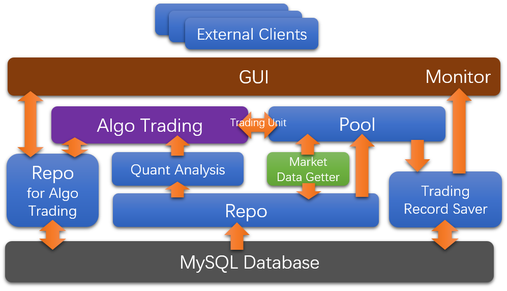

集思广益  大家想下
#FSC Final Presentation (5 min)

## Introduction
- Algorimthic Trading System Definitoin

## System Design / Components
- Python 
- MySQL

```
AlgoTrading
├── algo_trading  
│   ├── algoTrading.py
│   └── repoForAT.py
├── cli
│   └── cli.py
├── common
│   ├── MarketData.py
│   ├── clientOrder.py
│   ├── orderResult.py
│   └── tradingUnit.py
├── fetch_data
│   ├── changeDataFromSqliteToMysql.py
│   ├── marketDataGetter.py
│   └── repo.py
├── pool
│   ├── poolBase.py
│   ├── poolFromSinaApi.py
│   └── tradingRecordSaver.py
├── quant_analysis
│   ├── LinearVWAPQuantAnalysis.py
│   ├── TWAPQuantAnalysis.py
│   ├── VWAPQuantAnalysis.py
│   └── quantAnalysisBase.py
└── tool
    ├── ErrorCode.py
    ├── FigHelper.py
    ├── FileHelper.py
    ├── FileUtility.py
    └── Log.py
```


## Challenges & Solutions
- Data feed
  * crawl market data:
    * SinaAPI
    * 600000 601006 601377
- Volume Prediction
  - Simple Moving Average
  - Linear Weighted Moving Average
- Trading Strategy
  - Frequency Auto-adjustment Inspired by Congestion avoidance
    - Exponential growth / fall

## Features
- Volume/Price Prediction
  - Simple Moving Average
  - Linear Weighted Moving Average
- Active Trading Strategy / Frequency adjusts
- Both market order and limit order supported
- Realtime Pool / Back-test Pool / (Internal Pool)
- Data feed
- Monitor
- GUI & CLI
- High code coverage of test
- Informative Log

# Demo (10 min)
1. GUI
2. Start algoTrading
3. Place purchase order
   1. time: 2016-12-19/23   不超过25
   2. 必有可交易时间段
4. Show place orders
5. Delete orders
6. Execute order
7. Monitor
   1. trade records
   2. graph
8. Show the results
9. Run all unit tests
10. Show the log files

